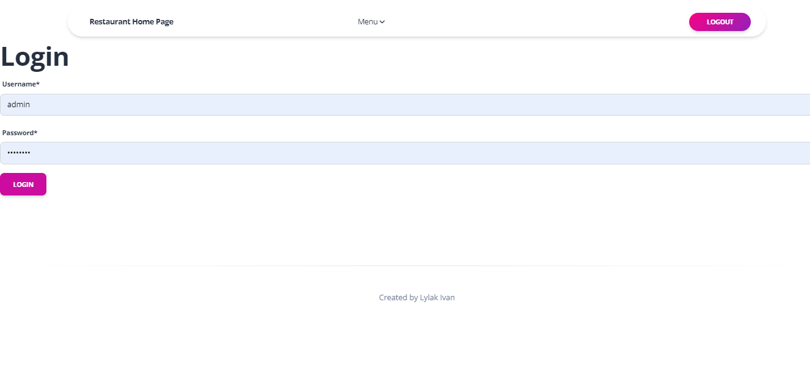
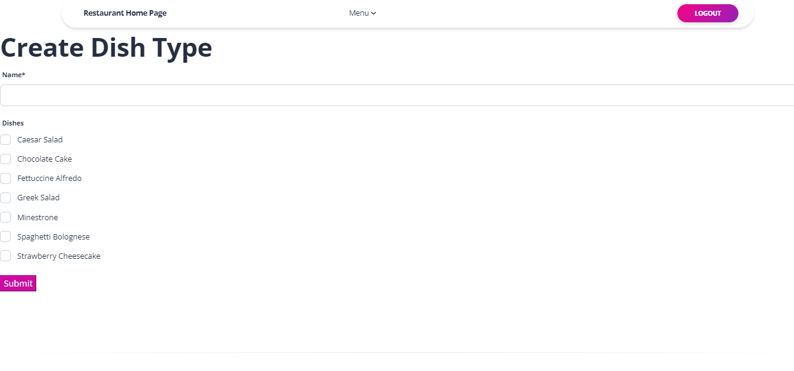
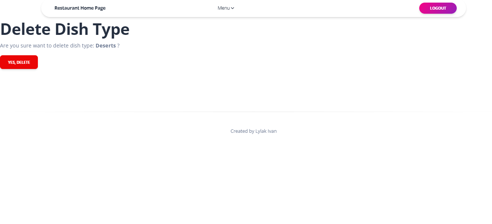
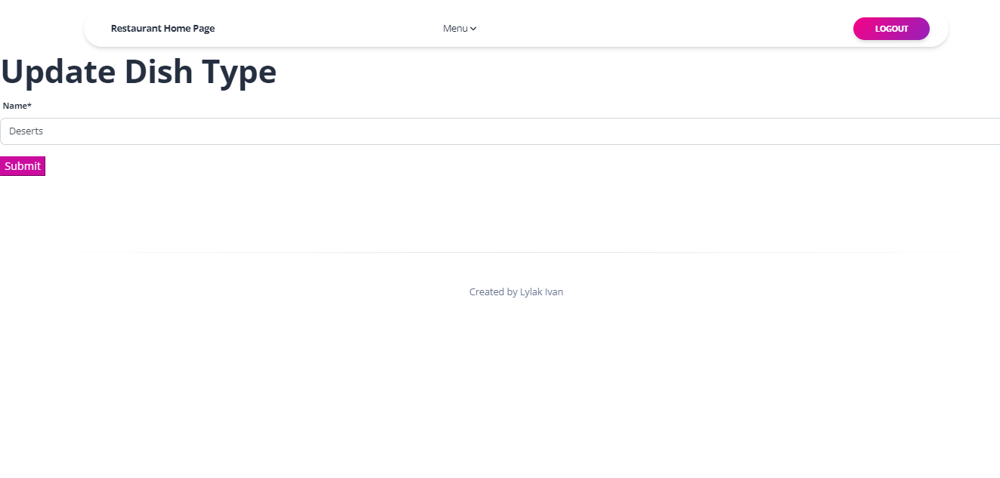
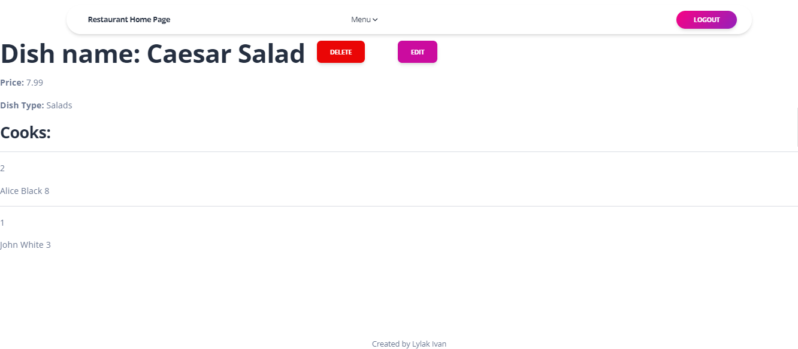
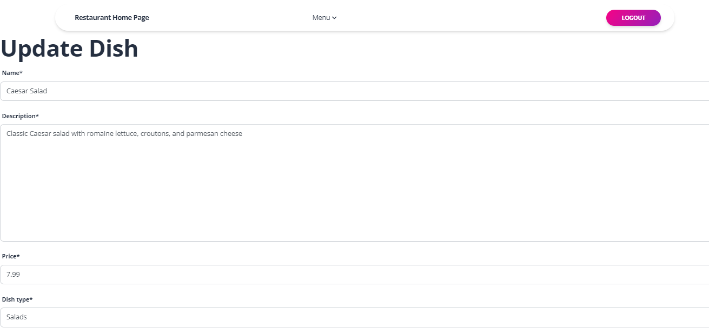
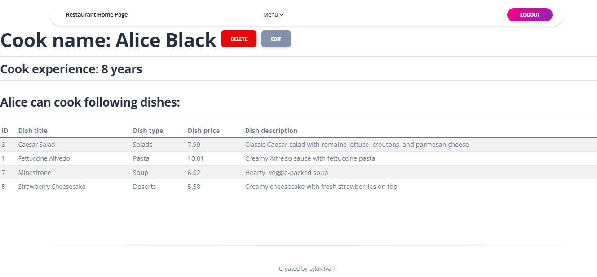

# Restaurant Kitchen Service

Django project for restaurant kitchen service

DB Structure


## Check it out

[Restaurant Kitchen Service deployed to Render](https://restaurant-mate-8on4.onrender.com)

You can use the following login details

Username: admin

Password: gtb?M237

## Installation

Pyhton3 should be already installed
```shell
git clone https://github.com/lylakivan/restaurant-kitchen-service
cd restaurant_kitchen_service
python3 -m venv venv
source venv/Script/activate
pip install -r requirements.txt
python manage.py runserver
```

## Features
1. **DishType Management:**
* Easily manage and categorize dishes with the DishType table.
* Add, edit, and delete dish types to organize the menu efficiently.

2. **Dish Management:**
* Create, update, and delete dishes with essential details such as name, description, and price.
* Associate dishes with specific DishTypes.

3. **Cook Management:**
* Efficiently manage cooks with the Cook table.
* Add, edit, and remove cooks responsible for preparing various dishes in the kitchen.

## Demo














